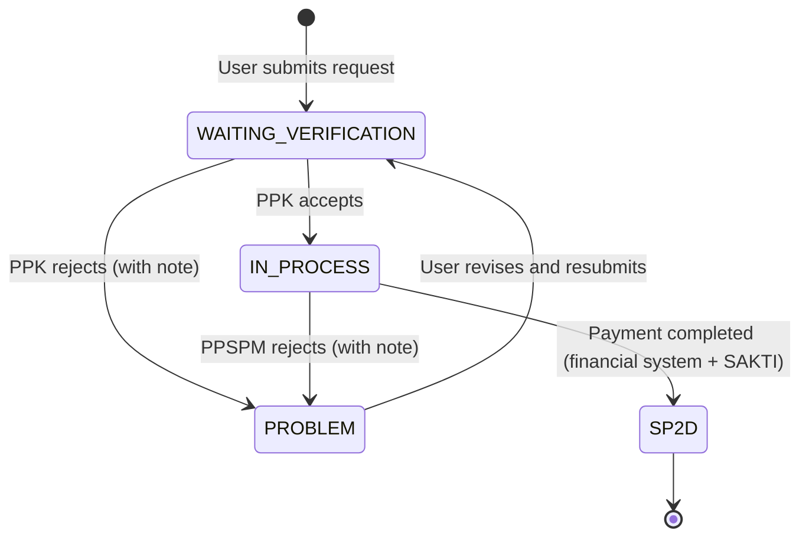

# Product Requirements Document

## E-PERJADIN SATKER — Indonesian Maritime Security Agency (Bakamla RI)

| Item | Detail |
| --- | --- |
| System Name | E-PERJADIN BAKAMLA RI |
| Date | 23 September 2026 |
| Prepared by | Vegga Chrisdiansyah Diwan, S.Ak (Technical Policy Analyst) |
| Agency | Indonesian Maritime Security Agency (Badan Keamanan Laut RI) |

> **Glossary (Indonesian terms kept as-is):** *Perjadin* = official business travel (perjalanan dinas); *SPRINT* = assignment order (Surat Perintah); *DIPA* = budget execution document; *PPK* = Commitment-Making Officer; *PPSPM* = Payment Order Signing Officer; *SBM* = Standard Input Cost (Standar Biaya Masukan); *TGR* = Compensation for Losses to the State (Tuntutan Ganti Rugi); *SP2D* = Fund Disbursement Order; *SAKTI* = the government's financial application system; *Satker* = work unit; *NIP/NIK* = employee ID / national ID number.

---

## 1. Executive Summary

Bakamla is a central agency that manages a single DIPA shared by several work units, all of which need fast financial management services. One of these services is official business travel (*perjalanan dinas*), which is still paper-based, conventional and slow.

Bakamla therefore needs a new web-based service to manage official travel requests electronically. Activity executors can prepare cost estimates and accountability documents (financial reports) on their own. The system will block further activities for any employee who commits fraud, until the TGR process is settled.

**Target:** the travel request process, which currently takes days on paper, should be completed within hours.

---

## 2. System Users

| Role | Example Person | What They Can Do |
| --- | --- | --- |
| Admin | Finance staff | Manage all master data and other users' access |
| PPK Verifier | PPK administrator | View and verify travel requests at the material level, and approve the cost calculation |
| PPSPM Verifier | Verification staff | View and verify travel requests after formal review, and submit the payment request |
| User | Employee | Submit a travel request after receiving a SPRINT |

---

## 3. Services to Be Built

### 3.1 Admin Management Menu (Admin role)

- Admin logs in and prepares the initial data.
- Admin imports the employee database as CSV from the Personnel Bureau: NIP, NIK, Name, Rank/Grade, Position, Work Unit.
- Admin maintains the database of treasury officials.
- Admin maintains the Standard Input Cost (SBM) database related to official travel.
- Admin creates templates for accountability documents.

### 3.2 Travel Request Menu (User role)

- User logs in to the financial system that has been implemented and selects E-Perjadin.
- User uploads the SPRINT to request official travel.
- User fills in the travel components: SPRINT number, SPRINT date, activity dates, activity location, and activity personnel.
- User submits the travel request for verification and waits for the request status.
- After the activity, User uploads the travel report plus supporting evidence (hotel invoice, boarding pass, etc.) as accountability.

### 3.3 Travel Verification Menu (PPK Verifier and PPSPM Verifier roles)

- The PPK Verifier receives the User's request, verifies it at the material level, and checks budget availability.
- The PPK Verifier approves and forwards the request through the financial system.
- The PPSPM Verifier receives the request from the financial system and reviews the calculation and the User's application.
- E-Perjadin displays a dashboard of each employee's travel history and records every trip the employee has taken, together with its calculation.
- After the activity, the User must upload the travel report with other attachments (boarding pass, ticket, transportation proof, hotel invoice, etc.). Otherwise the system blocks further requests and prepares the TGR mechanism.

### 3.4 Data to Be Stored

- Bakamla employee database
- Official travel budget database (account code 524xxx)
- Treasury official database
- Standard Input Cost (SBM) database (transportation, hotel, airfare, etc.)
- Travel request database (SPRINT number, SPRINT date, activity location, activity dates, personnel)
- Travel calculation database (approved nominative calculation list)
- Travel report database (PDF documents)
- Travel monitoring database per employee (how many activities an employee performed in a month)

### 3.5 Business Rules

- The system must prevent duplicate SPRINT numbers.
- The system must prevent one person from receiving two SPRINTs on overlapping activity dates.
- The system must block further requests from any employee who has not uploaded the travel report for their previous SPRINT.

---

## 4. Required Reports & Dashboards

| What They Want to See | Example |
| --- | --- |
| Request dashboard | Number of requests received and requests already submitted |
| Budget dashboard | Total travel budget, its realization and the remaining balance |
| Travel Monitoring Report | Monthly recap of all activity personnel and their activity dates |
| Budget Usage Report | Monthly recap of budget usage per SPRINT |

All dashboards must include **Export to PDF** and **Export to Excel** buttons.

---

## 5. Notes for the AI Coding Assistant

- Each user role gets a different menu based on the steps in Section 3.
- Admin has the management menu, Verifiers have the verification menu, and Employees (User) have the Travel Request menu. Employees additionally get a **Request Status** menu to follow the progress of a request and to see if any document still needs to be uploaded.
- Request status flow for an employee:

| Trigger | Status (UI label) | Suggested enum value |
| --- | --- | --- |
| Employee clicks submit | Waiting for verification | `WAITING_VERIFICATION` |
| Accepted by PPK Verifier | Request in process | `IN_PROCESS` |
| Rejected by PPK Verifier | Problem (with a note) | `PROBLEM` |
| Accepted by PPSPM Verifier | Request in process (until payment is made in the financial system and SAKTI) | `IN_PROCESS` |
| Payment completed | SP2D | `SP2D` |

- Every travel request record must also be written to the travel monitoring database.
- Section 4 is implemented as dashboards plus PDF/Excel export buttons.

> The `PROBLEM → WAITING_VERIFICATION` (resubmit) and PPSPM-rejection transitions are assumptions to confirm; the source document only defines rejection by the PPK Verifier.

---

## 6. Data Model

### 6.1 Entity Relationship Diagram

```mermaid
erDiagram
    ROLES ||--o{ USERS : "assigned to"
    EMPLOYEES ||--o| USERS : "has account"
    WORK_UNITS ||--o{ EMPLOYEES : "employs"
    EMPLOYEES ||--o{ TREASURY_OFFICIALS : "appointed as"
    WORK_UNITS ||--o{ BUDGET_ALLOCATIONS : "owns"
    BUDGET_ALLOCATIONS ||--o{ TRAVEL_REQUESTS : "funds"
    USERS ||--o{ TRAVEL_REQUESTS : "submits"
    TRAVEL_REQUESTS ||--|{ TRAVEL_REQUEST_PERSONNEL : "includes"
    EMPLOYEES ||--o{ TRAVEL_REQUEST_PERSONNEL : "assigned to"
    TRAVEL_REQUESTS ||--o| TRAVEL_COST_CALCULATIONS : "has"
    TRAVEL_COST_CALCULATIONS ||--|{ TRAVEL_COST_ITEMS : "contains"
    TRAVEL_REQUEST_PERSONNEL ||--o{ TRAVEL_COST_ITEMS : "incurs"
    STANDARD_COSTS ||--o{ TRAVEL_COST_ITEMS : "priced by"
    TRAVEL_REQUESTS ||--o{ VERIFICATIONS : "reviewed in"
    USERS ||--o{ VERIFICATIONS : "performs"
    TRAVEL_REQUESTS ||--o{ REQUEST_STATUS_HISTORY : "tracks"
    USERS ||--o{ REQUEST_STATUS_HISTORY : "changes"
    TRAVEL_REQUESTS ||--o| PAYMENTS : "paid by"
    TRAVEL_REQUESTS ||--o{ TRAVEL_REPORTS : "accounted by"
    DOCUMENT_TEMPLATES ||--o{ TRAVEL_REPORTS : "based on"
    TRAVEL_REPORTS ||--o{ REPORT_ATTACHMENTS : "has"
    EMPLOYEES ||--o{ TRAVEL_MONITORING : "monitored"
    TRAVEL_REQUESTS ||--o{ TRAVEL_MONITORING : "recorded in"
    EMPLOYEES ||--o{ EMPLOYEE_BLOCKS : "blocked by"
    TRAVEL_REQUESTS ||--o{ EMPLOYEE_BLOCKS : "triggers"
    USERS ||--o{ AUDIT_LOGS : "generates"

    ROLES {
        bigint id PK
        string code UK "ADMIN, PPK_VERIFIER, PPSPM_VERIFIER, USER"
        string name
        string description
    }

    USERS {
        bigint id PK
        bigint employee_id FK,UK
        bigint role_id FK
        string username UK
        string password_hash
        boolean is_active
        datetime last_login_at
        datetime created_at
        datetime updated_at
    }

    WORK_UNITS {
        bigint id PK
        string code UK
        string name
        boolean is_active
    }

    EMPLOYEES {
        bigint id PK
        string nip UK
        string nik UK
        string full_name
        string rank_grade
        string position
        bigint work_unit_id FK
        boolean is_active
        datetime imported_at
        datetime created_at
        datetime updated_at
    }

    TREASURY_OFFICIALS {
        bigint id PK
        bigint employee_id FK
        string official_type "PPK, PPSPM, TREASURER"
        string decree_number
        date valid_from
        date valid_until
        boolean is_active
    }

    BUDGET_ALLOCATIONS {
        bigint id PK
        bigint work_unit_id FK
        int fiscal_year
        string account_code "524xxx"
        string description
        decimal total_amount
        decimal committed_amount
        decimal realized_amount
        datetime updated_at
    }

    STANDARD_COSTS {
        bigint id PK
        string cost_type "TRANSPORT, HOTEL, AIRFARE, DAILY_ALLOWANCE, OTHER"
        string name
        string region_origin
        string region_destination
        string rank_group
        string unit "per day, per trip, per night"
        decimal unit_amount
        int fiscal_year
        date valid_from
        date valid_until
        boolean is_active
    }

    DOCUMENT_TEMPLATES {
        bigint id PK
        string name
        string document_type "TRAVEL_REPORT, ACCOUNTABILITY"
        string file_path
        int version
        boolean is_active
        bigint created_by FK
        datetime created_at
    }

    TRAVEL_REQUESTS {
        bigint id PK
        string sprint_number UK
        date sprint_date
        string sprint_file_path
        string activity_name
        string activity_location
        date activity_start_date
        date activity_end_date
        bigint budget_allocation_id FK
        bigint submitted_by FK
        string status "WAITING_VERIFICATION, IN_PROCESS, PROBLEM, SP2D"
        datetime submitted_at
        datetime created_at
        datetime updated_at
    }

    TRAVEL_REQUEST_PERSONNEL {
        bigint id PK
        bigint travel_request_id FK
        bigint employee_id FK
        date activity_start_date "denormalized for overlap check"
        date activity_end_date "denormalized for overlap check"
    }

    TRAVEL_COST_CALCULATIONS {
        bigint id PK
        bigint travel_request_id FK,UK
        decimal total_amount
        bigint approved_by FK
        datetime approved_at
        string notes
        datetime created_at
    }

    TRAVEL_COST_ITEMS {
        bigint id PK
        bigint calculation_id FK
        bigint personnel_id FK
        bigint standard_cost_id FK
        string description
        decimal quantity
        decimal unit_amount
        decimal subtotal
    }

    VERIFICATIONS {
        bigint id PK
        bigint travel_request_id FK
        bigint verifier_id FK
        string stage "PPK, PPSPM"
        string decision "ACCEPTED, REJECTED"
        string notes
        datetime verified_at
    }

    REQUEST_STATUS_HISTORY {
        bigint id PK
        bigint travel_request_id FK
        string old_status
        string new_status
        string notes
        bigint changed_by FK
        datetime changed_at
    }

    PAYMENTS {
        bigint id PK
        bigint travel_request_id FK,UK
        string sp2d_number
        string sakti_reference
        decimal amount
        date payment_date
        bigint processed_by FK
        datetime created_at
    }

    TRAVEL_REPORTS {
        bigint id PK
        bigint travel_request_id FK
        bigint template_id FK
        bigint submitted_by FK
        string report_file_path "PDF"
        date due_date
        string status "PENDING, SUBMITTED, OVERDUE"
        datetime submitted_at
    }

    REPORT_ATTACHMENTS {
        bigint id PK
        bigint travel_report_id FK
        string attachment_type "BOARDING_PASS, TICKET, TRANSPORT_PROOF, HOTEL_INVOICE, OTHER"
        string file_name
        string file_path
        datetime uploaded_at
    }

    TRAVEL_MONITORING {
        bigint id PK
        bigint employee_id FK
        bigint travel_request_id FK
        int period_month
        int period_year
        date activity_start_date
        date activity_end_date
        decimal approved_amount
        string report_status "PENDING, SUBMITTED, OVERDUE"
        datetime recorded_at
    }

    EMPLOYEE_BLOCKS {
        bigint id PK
        bigint employee_id FK
        bigint travel_request_id FK
        string reason
        string status "ACTIVE, TGR_PROCESS, RESOLVED"
        string tgr_reference
        datetime blocked_at
        datetime resolved_at
        bigint resolved_by FK
    }

    AUDIT_LOGS {
        bigint id PK
        bigint user_id FK
        string action
        string entity_name
        bigint entity_id
        text old_value
        text new_value
        string ip_address
        datetime created_at
    }
```

### 6.2 Data Dictionary

Legend: **PK** = primary key, **FK** = foreign key, **UK** = unique key, **NN** = not null.

#### `roles`

| Column | Type | Constraints | Description |
| --- | --- | --- | --- |
| id | bigint | PK | Role identifier |
| code | varchar(30) | UK, NN | `ADMIN`, `PPK_VERIFIER`, `PPSPM_VERIFIER`, `USER` |
| name | varchar(100) | NN | Display name |
| description | varchar(255) | | What the role can do |

#### `users`

| Column | Type | Constraints | Description |
| --- | --- | --- | --- |
| id | bigint | PK | User identifier |
| employee_id | bigint | FK → employees.id, UK, NN | Employee who owns the account |
| role_id | bigint | FK → roles.id, NN | Assigned role |
| username | varchar(100) | UK, NN | Login name (or SSO identity of the financial system) |
| password_hash | varchar(255) | | Hashed password; may be empty if authentication is delegated to the financial system |
| is_active | boolean | NN, default true | Whether the account can log in |
| last_login_at | timestamp | | Last successful login |
| created_at / updated_at | timestamp | NN | Audit timestamps |

#### `work_units`

| Column | Type | Constraints | Description |
| --- | --- | --- | --- |
| id | bigint | PK | Work unit identifier |
| code | varchar(30) | UK, NN | Work unit code |
| name | varchar(200) | NN | Work unit name |
| is_active | boolean | NN, default true | Active flag |

#### `employees`

Populated by CSV import from the Personnel Bureau.

| Column | Type | Constraints | Description |
| --- | --- | --- | --- |
| id | bigint | PK | Internal identifier |
| nip | varchar(18) | UK, NN | Employee ID number |
| nik | varchar(16) | UK, NN | National ID number |
| full_name | varchar(200) | NN | Full name |
| rank_grade | varchar(50) | NN | Rank / grade (used to select the applicable SBM) |
| position | varchar(200) | | Job position |
| work_unit_id | bigint | FK → work_units.id, NN | Work unit |
| is_active | boolean | NN, default true | Active employee flag |
| imported_at | timestamp | | Time of last CSV import |
| created_at / updated_at | timestamp | NN | Audit timestamps |

#### `treasury_officials`

| Column | Type | Constraints | Description |
| --- | --- | --- | --- |
| id | bigint | PK | Identifier |
| employee_id | bigint | FK → employees.id, NN | Employee appointed to the role |
| official_type | varchar(30) | NN | `PPK`, `PPSPM`, `TREASURER` |
| decree_number | varchar(100) | | Appointment decree number |
| valid_from | date | NN | Start of appointment |
| valid_until | date | | End of appointment |
| is_active | boolean | NN, default true | Active flag |

#### `budget_allocations`

Official travel budget (account code 524xxx).

| Column | Type | Constraints | Description |
| --- | --- | --- | --- |
| id | bigint | PK | Identifier |
| work_unit_id | bigint | FK → work_units.id, NN | Owning work unit |
| fiscal_year | int | NN | Budget year |
| account_code | varchar(10) | NN | Expenditure account code, e.g. `524111` |
| description | varchar(255) | | Description of the budget line |
| total_amount | decimal(18,2) | NN | Total budget |
| committed_amount | decimal(18,2) | NN, default 0 | Amount reserved by requests in process |
| realized_amount | decimal(18,2) | NN, default 0 | Amount already paid (SP2D) |
| updated_at | timestamp | NN | Last update |

Remaining balance = `total_amount − committed_amount − realized_amount` (derived, not stored).

#### `standard_costs`

Standard Input Cost (SBM) master data.

| Column | Type | Constraints | Description |
| --- | --- | --- | --- |
| id | bigint | PK | Identifier |
| cost_type | varchar(30) | NN | `TRANSPORT`, `HOTEL`, `AIRFARE`, `DAILY_ALLOWANCE`, `OTHER` |
| name | varchar(200) | NN | Cost item name |
| region_origin | varchar(100) | | Origin region (where applicable) |
| region_destination | varchar(100) | | Destination region |
| rank_group | varchar(50) | | Rank group the rate applies to |
| unit | varchar(30) | NN | Unit of measure (per day, per night, per trip) |
| unit_amount | decimal(18,2) | NN | Maximum rate per unit |
| fiscal_year | int | NN | Regulation year |
| valid_from / valid_until | date | | Validity period |
| is_active | boolean | NN, default true | Active flag |

#### `document_templates`

| Column | Type | Constraints | Description |
| --- | --- | --- | --- |
| id | bigint | PK | Identifier |
| name | varchar(200) | NN | Template name |
| document_type | varchar(50) | NN | e.g. `TRAVEL_REPORT`, `ACCOUNTABILITY` |
| file_path | varchar(500) | NN | Stored template file |
| version | int | NN, default 1 | Template version |
| is_active | boolean | NN, default true | Active flag |
| created_by | bigint | FK → users.id | Admin who created it |
| created_at | timestamp | NN | Creation time |

#### `travel_requests`

| Column | Type | Constraints | Description |
| --- | --- | --- | --- |
| id | bigint | PK | Identifier |
| sprint_number | varchar(100) | UK, NN | SPRINT number (**no duplicates allowed**) |
| sprint_date | date | NN | SPRINT date |
| sprint_file_path | varchar(500) | NN | Uploaded SPRINT file |
| activity_name | varchar(255) | | Activity title / purpose |
| activity_location | varchar(255) | NN | Activity location |
| activity_start_date | date | NN | First day of the activity |
| activity_end_date | date | NN | Last day of the activity |
| budget_allocation_id | bigint | FK → budget_allocations.id | Budget line funding the trip |
| submitted_by | bigint | FK → users.id, NN | User who created the request |
| status | varchar(30) | NN | `WAITING_VERIFICATION`, `IN_PROCESS`, `PROBLEM`, `SP2D` |
| submitted_at | timestamp | | When the request was submitted |
| created_at / updated_at | timestamp | NN | Audit timestamps |

#### `travel_request_personnel`

| Column | Type | Constraints | Description |
| --- | --- | --- | --- |
| id | bigint | PK | Identifier |
| travel_request_id | bigint | FK → travel_requests.id, NN | Parent request |
| employee_id | bigint | FK → employees.id, NN | Assigned employee |
| activity_start_date | date | NN | Copied from the request; used for the overlap rule |
| activity_end_date | date | NN | Copied from the request; used for the overlap rule |

Unique: (`travel_request_id`, `employee_id`). The "no double SPRINT on the same dates" rule is enforced on (`employee_id`, date range), for example with a PostgreSQL exclusion constraint or a transactional check. Requests in `PROBLEM` (rejected) should be excluded from the check.

#### `travel_cost_calculations`

Approved nominative calculation list (one per request).

| Column | Type | Constraints | Description |
| --- | --- | --- | --- |
| id | bigint | PK | Identifier |
| travel_request_id | bigint | FK → travel_requests.id, UK, NN | Related request |
| total_amount | decimal(18,2) | NN | Sum of all cost items |
| approved_by | bigint | FK → users.id | PPK Verifier who approved |
| approved_at | timestamp | | Approval time |
| notes | varchar(500) | | Remarks |
| created_at | timestamp | NN | Creation time |

#### `travel_cost_items`

| Column | Type | Constraints | Description |
| --- | --- | --- | --- |
| id | bigint | PK | Identifier |
| calculation_id | bigint | FK → travel_cost_calculations.id, NN | Parent calculation |
| personnel_id | bigint | FK → travel_request_personnel.id, NN | Person the cost belongs to |
| standard_cost_id | bigint | FK → standard_costs.id | SBM rate applied |
| description | varchar(255) | | Item description |
| quantity | decimal(10,2) | NN | Number of units (days, nights, trips) |
| unit_amount | decimal(18,2) | NN | Rate applied |
| subtotal | decimal(18,2) | NN | `quantity × unit_amount` |

#### `verifications`

| Column | Type | Constraints | Description |
| --- | --- | --- | --- |
| id | bigint | PK | Identifier |
| travel_request_id | bigint | FK → travel_requests.id, NN | Request being verified |
| verifier_id | bigint | FK → users.id, NN | Verifier |
| stage | varchar(10) | NN | `PPK` or `PPSPM` |
| decision | varchar(10) | NN | `ACCEPTED` or `REJECTED` |
| notes | varchar(1000) | | Required when rejected |
| verified_at | timestamp | NN | Decision time |

#### `request_status_history`

| Column | Type | Constraints | Description |
| --- | --- | --- | --- |
| id | bigint | PK | Identifier |
| travel_request_id | bigint | FK → travel_requests.id, NN | Request |
| old_status | varchar(30) | | Previous status |
| new_status | varchar(30) | NN | New status |
| notes | varchar(1000) | | Note shown to the employee |
| changed_by | bigint | FK → users.id | Who changed it |
| changed_at | timestamp | NN | Change time |

#### `payments`

| Column | Type | Constraints | Description |
| --- | --- | --- | --- |
| id | bigint | PK | Identifier |
| travel_request_id | bigint | FK → travel_requests.id, UK, NN | Paid request |
| sp2d_number | varchar(100) | UK, NN | SP2D number |
| sakti_reference | varchar(100) | | Reference in SAKTI |
| amount | decimal(18,2) | NN | Amount paid |
| payment_date | date | NN | Payment date |
| processed_by | bigint | FK → users.id | PPSPM Verifier who processed it |
| created_at | timestamp | NN | Creation time |

#### `travel_reports`

| Column | Type | Constraints | Description |
| --- | --- | --- | --- |
| id | bigint | PK | Identifier |
| travel_request_id | bigint | FK → travel_requests.id, NN | Related request |
| template_id | bigint | FK → document_templates.id | Template used |
| submitted_by | bigint | FK → users.id | Uploader |
| report_file_path | varchar(500) | | Report PDF |
| due_date | date | NN | Deadline for upload; drives the block rule |
| status | varchar(20) | NN | `PENDING`, `SUBMITTED`, `OVERDUE` |
| submitted_at | timestamp | | Upload time |

#### `report_attachments`

| Column | Type | Constraints | Description |
| --- | --- | --- | --- |
| id | bigint | PK | Identifier |
| travel_report_id | bigint | FK → travel_reports.id, NN | Parent report |
| attachment_type | varchar(30) | NN | `BOARDING_PASS`, `TICKET`, `TRANSPORT_PROOF`, `HOTEL_INVOICE`, `OTHER` |
| file_name | varchar(255) | NN | Original file name |
| file_path | varchar(500) | NN | Stored file |
| uploaded_at | timestamp | NN | Upload time |

#### `travel_monitoring`

One row per employee per request; feeds the monitoring report and the employee travel history dashboard.

| Column | Type | Constraints | Description |
| --- | --- | --- | --- |
| id | bigint | PK | Identifier |
| employee_id | bigint | FK → employees.id, NN | Employee |
| travel_request_id | bigint | FK → travel_requests.id, NN | Request |
| period_month | int | NN | Month (1–12) of the activity |
| period_year | int | NN | Year of the activity |
| activity_start_date | date | NN | Start date |
| activity_end_date | date | NN | End date |
| approved_amount | decimal(18,2) | | Approved calculation for this employee |
| report_status | varchar(20) | NN | `PENDING`, `SUBMITTED`, `OVERDUE` |
| recorded_at | timestamp | NN | Record creation time |

#### `employee_blocks`

| Column | Type | Constraints | Description |
| --- | --- | --- | --- |
| id | bigint | PK | Identifier |
| employee_id | bigint | FK → employees.id, NN | Blocked employee |
| travel_request_id | bigint | FK → travel_requests.id, NN | Request that caused the block |
| reason | varchar(500) | NN | e.g. travel report not uploaded |
| status | varchar(20) | NN | `ACTIVE`, `TGR_PROCESS`, `RESOLVED` |
| tgr_reference | varchar(100) | | TGR case reference |
| blocked_at | timestamp | NN | Block start |
| resolved_at | timestamp | | Block end |
| resolved_by | bigint | FK → users.id | Admin who lifted the block |

A new request is rejected at submission when the employee has any `ACTIVE` or `TGR_PROCESS` block, or a `travel_reports` row that is `OVERDUE`.

#### `audit_logs`

| Column | Type | Constraints | Description |
| --- | --- | --- | --- |
| id | bigint | PK | Identifier |
| user_id | bigint | FK → users.id | Acting user |
| action | varchar(50) | NN | e.g. `CREATE`, `UPDATE`, `APPROVE`, `LOGIN` |
| entity_name | varchar(100) | NN | Table / entity affected |
| entity_id | bigint | | Affected record |
| old_value | text | | Previous value (JSON) |
| new_value | text | | New value (JSON) |
| ip_address | varchar(45) | | Source IP |
| created_at | timestamp | NN | Event time |

### 6.3 Mapping of Required Databases to Tables

| Required Database (Section 3.4) | Table(s) |
| --- | --- |
| Employee database | `employees`, `work_units` |
| Travel budget database (524xxx) | `budget_allocations` |
| Treasury official database | `treasury_officials` |
| Standard Input Cost database | `standard_costs` |
| Travel request database | `travel_requests`, `travel_request_personnel`, `verifications`, `request_status_history` |
| Travel calculation database | `travel_cost_calculations`, `travel_cost_items`, `payments` |
| Travel report database | `travel_reports`, `report_attachments`, `document_templates` |
| Travel monitoring database | `travel_monitoring`, `employee_blocks` |
| Users and access | `users`, `roles`, `audit_logs` |

### 6.4 Data Model Assumptions to Confirm

- The source PRD lists what data must be stored but not the exact fields; the tables and columns above are a proposed design derived from it.
- `budget_allocations` tracks committed and realized amounts to support the budget dashboard (total, realization, remaining).
- `employee_blocks` includes a TGR reference only as a link to the TGR process; the TGR workflow itself is not detailed in the source and is out of scope for this model.
- `travel_reports.due_date` needs a business rule (e.g. N days after the activity end date) that Bakamla should specify.
