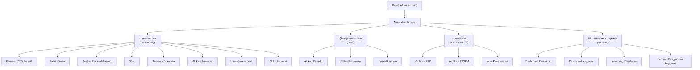
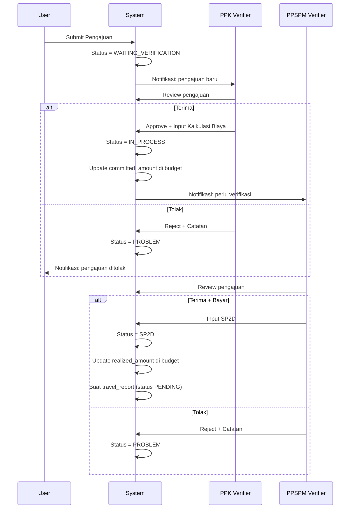
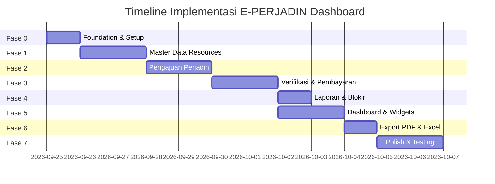

# 🚀 Rencana Aksi — Dashboard E-PERJADIN Bakamla RI
## Filament v5 + Laravel 13 + Livewire 4

---

## 📋 Status Proyek Saat Ini

| Komponen | Status |
|---|---|
| Laravel 13 + Filament v5.8 | ✅ Terinstall |
| 20 Model Eloquent | ✅ Lengkap |
| 23 Migration files | ✅ Lengkap |
| AdminPanelProvider | ✅ Terdaftar (panel `admin`) |
| Filament Resources | ❌ Belum dibuat |
| Filament Widgets | ❌ Belum dibuat |
| Custom Pages | ❌ Belum dibuat |
| Policies & Authorization | ❌ Belum dibuat |
| Seeders (data awal) | ❌ Belum dibuat |

> [!NOTE]
> Filament v5 **tidak ada breaking changes** dari v4. Perbedaan utamanya adalah dukungan Livewire v4 (Islands architecture) untuk performa widget yang lebih baik.

---

## 🏗️ Arsitektur Panel

Berdasarkan PRD, ada **4 role** dengan menu berbeda. Kita menggunakan **1 panel** dengan **navigation grouping + policy-based visibility**, bukan multi-panel.



---

## 📦 Fase Implementasi

### Fase 0 — Foundation & Setup (Estimasi: 1–2 jam)

Menyiapkan fondasi sebelum membangun fitur.

| # | Task | Detail | File/Command |
|---|---|---|---|
| 0.1 | Jalankan migration | Pastikan semua tabel terbuat di SQLite | `php artisan migrate` |
| 0.2 | Buat RoleSeeder | Seed 4 role: `ADMIN`, `PPK_VERIFIER`, `PPSPM_VERIFIER`, `USER` | `database/seeders/RoleSeeder.php` |
| 0.3 | Buat UserSeeder | Seed user admin pertama untuk testing | `database/seeders/UserSeeder.php` |
| 0.4 | Implementasi `FilamentUser` | User model implements `FilamentUser`, method `canAccessPanel()` berdasarkan `is_active` | [User.php](file:///Users/vegga/Website%20Latihan/sil-app/app/Models/User.php) |
| 0.5 | Konfigurasi Panel | Update `AdminPanelProvider` — set brand name, favicon, navigation groups, global search, SPA mode | [AdminPanelProvider.php](file:///Users/vegga/Website%20Latihan/sil-app/app/Providers/Filament/AdminPanelProvider.php) |
| 0.6 | Buat base Policy helper | Trait `ChecksRole` untuk reuse di semua Policy | `app/Traits/ChecksRole.php` |

**Deliverable:** Login ke `/admin` dengan user admin, panel kosong siap diisi.

---

### Fase 1 — Master Data Resources (Estimasi: 3–4 jam)

Membangun CRUD master data untuk Admin. Semua resource di fase ini hanya bisa diakses oleh role `ADMIN`.

| # | Resource | Model | Fitur Kunci |
|---|---|---|---|
| 1.1 | `WorkUnitResource` | `WorkUnit` | CRUD standar, toggle `is_active` |
| 1.2 | `EmployeeResource` | `Employee` | **CSV Import** (Filament Import Action), filter by work unit, search by NIP/NIK/nama, bulk toggle active |
| 1.3 | `TreasuryOfficialResource` | `TreasuryOfficial` | Select employee, pilih type (PPK/PPSPM/TREASURER), validasi tanggal |
| 1.4 | `StandardCostResource` | `StandardCost` | Filter by cost_type, fiscal_year. Grup region origin → destination |
| 1.5 | `DocumentTemplateResource` | `DocumentTemplate` | Upload file template, versioning |
| 1.6 | `BudgetAllocationResource` | `BudgetAllocation` | Input pagu anggaran per satker, tampilkan sisa anggaran (computed) |
| 1.7 | `UserResource` | `User` | Manage akun, pilih employee + role, toggle active |
| 1.8 | `RoleResource` | `Role` | Read-only view (roles fixed via seeder) |

#### Detail Teknis Fase 1

**1.2 — Employee CSV Import (Prioritas Tinggi):**
```
Kolom CSV: NIP, NIK, Nama Lengkap, Pangkat/Golongan, Jabatan, Kode Satker
```
- Gunakan `Filament\Actions\Imports\ImportAction` + `Filament\Actions\Imports\Importer`
- Buat `EmployeeImporter` class
- Validasi: NIP & NIK unik, work_unit_id resolved dari kode satker
- Set `imported_at` otomatis

**1.6 — Budget Allocation:**
- Tampilkan kolom virtual `Sisa Anggaran` = `total_amount - committed_amount - realized_amount`
- Warna badge: hijau (>50%), kuning (20-50%), merah (<20%)

**Policies yang dibuat:**

| Policy | Akses |
|---|---|
| `WorkUnitPolicy` | Admin only |
| `EmployeePolicy` | Admin only |
| `TreasuryOfficialPolicy` | Admin only |
| `StandardCostPolicy` | Admin only |
| `DocumentTemplatePolicy` | Admin only |
| `BudgetAllocationPolicy` | Admin only |
| `UserPolicy` | Admin only |

**Deliverable:** Admin bisa login, import pegawai via CSV, kelola semua master data.

---

### Fase 2 — Pengajuan Perjalanan Dinas (Estimasi: 4–5 jam)

Fitur inti untuk role `USER` — mengajukan perjalanan dinas.

| # | Komponen | Tipe | Detail |
|---|---|---|---|
| 2.1 | `TravelRequestResource` | Resource | CRUD pengajuan perjadin |
| 2.2 | Create form | Form | Upload SPRINT, isi komponen, pilih personel |
| 2.3 | Validasi bisnis | Backend | Cek duplikasi SPRINT, overlap tanggal, blokir pegawai |
| 2.4 | Submit action | Action | Tombol "Ajukan" → status `WAITING_VERIFICATION` |
| 2.5 | Status tracking page | Custom Page | Halaman status pengajuan per user |

#### Detail Teknis Fase 2

**2.2 — Form Pengajuan:**
```
Wizard Steps:
├── Step 1: Data SPRINT
│   ├── Upload file SPRINT (PDF)
│   ├── Nomor SPRINT (unique validation)
│   ├── Tanggal SPRINT
│   └── Nama Kegiatan
│
├── Step 2: Detail Kegiatan  
│   ├── Lokasi Kegiatan
│   ├── Tanggal Mulai
│   ├── Tanggal Selesai
│   └── Pilih Alokasi Anggaran (Select filtered by fiscal_year)
│
└── Step 3: Personel
    └── Repeater → Select Employee (with search)
        ├── Validasi: tidak boleh overlap dengan SPRINT lain
        └── Validasi: employee tidak sedang diblokir
```

**2.3 — Business Rules (di Model/Service):**
```php
// Rule 1: Cegah duplikasi nomor SPRINT
'sprint_number' => 'required|unique:travel_requests,sprint_number'

// Rule 2: Cegah overlap tanggal per pegawai
// Query: cek travel_request_personnel WHERE employee_id = X 
//   AND status != 'PROBLEM'
//   AND daterange overlaps

// Rule 3: Blokir pegawai yang belum upload laporan
// Query: cek employee_blocks WHERE status IN ('ACTIVE','TGR_PROCESS')
//   ATAU travel_reports WHERE status = 'OVERDUE'
```

**2.5 — Status Tracking:**
- Tabel pengajuan milik user yang login
- Badge warna per status:
  - `WAITING_VERIFICATION` → 🟡 Kuning
  - `IN_PROCESS` → 🔵 Biru
  - `PROBLEM` → 🔴 Merah (tampilkan catatan)
  - `SP2D` → 🟢 Hijau
- Timeline history perubahan status

**Deliverable:** User bisa submit pengajuan, melihat status, dan mendapat validasi otomatis.

---

### Fase 3 — Verifikasi & Pembayaran (Estimasi: 4–5 jam)

Fitur untuk role `PPK_VERIFIER` dan `PPSPM_VERIFIER`.

| # | Komponen | Tipe | Detail |
|---|---|---|---|
| 3.1 | Verifikasi PPK | Custom Resource Page | List request `WAITING_VERIFICATION`, approve/reject |
| 3.2 | Kalkulasi Biaya | Relation Manager | Input item biaya berdasarkan SBM per personel |
| 3.3 | Verifikasi PPSPM | Custom Resource Page | List request `IN_PROCESS` (sudah di-approve PPK) |
| 3.4 | Input Pembayaran | Action | Catat nomor SP2D, referensi SAKTI |
| 3.5 | Status History | Auto | Catat setiap perubahan status + user yang mengubah |

#### Detail Teknis Fase 3

**3.1 — Alur Verifikasi PPK:**


**3.2 — Kalkulasi Biaya:**
- `TravelCostCalculationRelationManager` di `TravelRequestResource`
- Repeater `TravelCostItem`: pilih personel → pilih SBM → auto-fill unit_amount → input quantity → hitung subtotal
- Total otomatis di header

**3.4 — Pembayaran:**
- Custom action `RecordPayment` di halaman verifikasi PPSPM
- Form: `sp2d_number`, `sakti_reference`, `amount`, `payment_date`
- Side effect: 
  - `travel_requests.status` → `SP2D`
  - `budget_allocations.realized_amount` += amount
  - `budget_allocations.committed_amount` -= amount
  - Buat record `travel_reports` dengan `status = PENDING` dan `due_date = activity_end_date + N hari`
  - Buat record `travel_monitoring` per personel

**Deliverable:** PPK bisa approve/reject + hitung biaya, PPSPM bisa verifikasi + catat pembayaran.

---

### Fase 4 — Laporan Pertanggungjawaban & Blokir (Estimasi: 2–3 jam)

| # | Komponen | Detail |
|---|---|---|
| 4.1 | Upload Laporan Perjalanan | User upload PDF laporan + lampiran (boarding pass, invoice hotel, dll) |
| 4.2 | Manajemen Lampiran | Repeater upload multi-file dengan tipe attachment |
| 4.3 | Auto-block mechanism | Scheduler: cek `travel_reports` yang melewati `due_date` → buat `employee_blocks` |
| 4.4 | EmployeeBlock Resource | Admin kelola blokir: lihat, proses TGR, resolve |

#### Detail Teknis Fase 4

**4.1 — Upload Laporan:**
- Halaman custom atau Action di `TravelRequestResource` (view page)
- Muncul hanya saat `status = SP2D` dan `travel_reports.status = PENDING`
- Form: upload PDF + repeater lampiran
- Setelah upload: `travel_reports.status` → `SUBMITTED`, update `travel_monitoring.report_status`

**4.3 — Auto-block (Artisan Command + Scheduler):**
```php
// app/Console/Commands/CheckOverdueReports.php
// Cek travel_reports WHERE status = 'PENDING' AND due_date < today
// → Update status = 'OVERDUE'
// → Buat employee_blocks (status = 'ACTIVE')

// Daftarkan di routes/console.php
Schedule::command('perjadin:check-overdue')->daily();
```

**Deliverable:** User bisa upload laporan, sistem otomatis blokir pegawai yang terlambat.

---

### Fase 5 — Dashboard & Widgets (Estimasi: 3–4 jam)

Implementasi 4 dashboard dari PRD Section 4.

| # | Widget | Tipe | Data |
|---|---|---|---|
| 5.1 | Stats Overview — Pengajuan | `StatsOverviewWidget` | Total pengajuan, menunggu verifikasi, dalam proses, selesai (SP2D), bermasalah |
| 5.2 | Stats Overview — Anggaran | `StatsOverviewWidget` | Total pagu, realisasi, sisa anggaran (dengan percentage bar) |
| 5.3 | Chart — Tren Pengajuan | `ChartWidget` (Line) | Jumlah pengajuan per bulan (12 bulan terakhir) |
| 5.4 | Chart — Realisasi Anggaran | `ChartWidget` (Bar) | Realisasi vs Pagu per satker |
| 5.5 | Tabel — Pengajuan Terbaru | `TableWidget` | 10 pengajuan terbaru dengan status badge |
| 5.6 | Tabel — Pegawai Terblokir | `TableWidget` | Daftar pegawai yang sedang diblokir |

#### Detail Teknis Fase 5

**Layout Dashboard:**
```
┌─────────────────────────────────────────────┐
│           Stats Overview — Pengajuan         │
│  [Diterima: 45] [Proses: 12] [SP2D: 30]    │
│  [Masalah: 3]                                │
├─────────────────────────────────────────────┤
│           Stats Overview — Anggaran          │
│  [Pagu: Rp 5M] [Realisasi: Rp 3M]          │
│  [Sisa: Rp 2M (40%)]                        │
├──────────────────────┬──────────────────────┤
│  Chart Tren Pengajuan│ Chart Realisasi      │
│  (Line Chart)        │ (Bar Chart)          │
├──────────────────────┴──────────────────────┤
│        Tabel Pengajuan Terbaru               │
├─────────────────────────────────────────────┤
│        Tabel Pegawai Terblokir (Admin only)  │
└─────────────────────────────────────────────┘
```

**Widget Visibility per Role:**
| Widget | Admin | PPK | PPSPM | User |
|---|---|---|---|---|
| Stats Pengajuan | ✅ (semua) | ✅ (semua) | ✅ (semua) | ✅ (milik sendiri) |
| Stats Anggaran | ✅ | ✅ | ✅ | ❌ |
| Chart Tren | ✅ | ✅ | ✅ | ❌ |
| Chart Realisasi | ✅ | ✅ | ✅ | ❌ |
| Tabel Terbaru | ✅ | ✅ | ✅ | ✅ (milik sendiri) |
| Tabel Terblokir | ✅ | ❌ | ❌ | ❌ |

**Deliverable:** Dashboard interaktif sesuai PRD Section 4.

---

### Fase 6 — Export PDF & Excel (Estimasi: 2–3 jam)

| # | Task | Detail |
|---|---|---|
| 6.1 | Install package export | `maatwebsite/excel` + `barryvdh/laravel-dompdf` |
| 6.2 | Export Tabel Pengajuan | Tombol Export di `TravelRequestResource` → PDF & Excel |
| 6.3 | Export Monitoring Perjalanan | Rekap bulanan per pegawai → PDF & Excel |
| 6.4 | Export Penggunaan Anggaran | Rekap bulanan per SPRINT → PDF & Excel |
| 6.5 | Export dari Dashboard | Tombol export di setiap widget tabel |

#### Detail Teknis Fase 6

**Export menggunakan Filament Table Export Action:**
```php
// Di table() method resource
->headerActions([
    Tables\Actions\ExportAction::make()
        ->exporter(TravelRequestExporter::class)
        ->formats([ExportFormat::Xlsx, ExportFormat::Csv]),
])
```

**PDF Export (custom view):**
- Buat Blade views: `exports/monitoring-report.blade.php`, `exports/budget-report.blade.php`
- Route + Controller untuk generate PDF via DomPDF
- Tombol di dashboard widget mengarah ke route export

**Deliverable:** Semua laporan di PRD Section 4 bisa di-export ke PDF dan Excel.

---

### Fase 7 — Polish & Keamanan (Estimasi: 2–3 jam)

| # | Task | Detail |
|---|---|---|
| 7.1 | Audit Logging | Global observer / middleware untuk catat semua aksi ke `audit_logs` |
| 7.2 | Database Notifications | Filament notification ke user saat status berubah |
| 7.3 | Global Search | Konfigurasi searchable columns di semua resource |
| 7.4 | Testing | Feature test untuk business rules (duplikasi SPRINT, overlap, blokir) |
| 7.5 | Seeder lengkap | Data dummy untuk demo: pegawai, SBM, pengajuan sample |

---

## 📁 Struktur File yang Akan Dibuat

```
app/
├── Filament/
│   ├── Resources/
│   │   ├── WorkUnitResource.php
│   │   ├── WorkUnitResource/Pages/
│   │   ├── EmployeeResource.php
│   │   ├── EmployeeResource/Pages/
│   │   ├── TreasuryOfficialResource.php
│   │   ├── TreasuryOfficialResource/Pages/
│   │   ├── StandardCostResource.php
│   │   ├── StandardCostResource/Pages/
│   │   ├── DocumentTemplateResource.php
│   │   ├── DocumentTemplateResource/Pages/
│   │   ├── BudgetAllocationResource.php
│   │   ├── BudgetAllocationResource/Pages/
│   │   ├── UserResource.php
│   │   ├── UserResource/Pages/
│   │   ├── TravelRequestResource.php
│   │   ├── TravelRequestResource/Pages/
│   │   │   ├── ListTravelRequests.php
│   │   │   ├── CreateTravelRequest.php
│   │   │   ├── EditTravelRequest.php
│   │   │   └── ViewTravelRequest.php
│   │   ├── TravelRequestResource/RelationManagers/
│   │   │   ├── PersonnelRelationManager.php
│   │   │   ├── CostCalculationRelationManager.php
│   │   │   ├── VerificationsRelationManager.php
│   │   │   └── ReportsRelationManager.php
│   │   ├── PaymentResource.php
│   │   ├── EmployeeBlockResource.php
│   │   └── AuditLogResource.php
│   │
│   ├── Pages/
│   │   ├── Dashboard.php (custom)
│   │   ├── PpkVerification.php
│   │   ├── PpspmVerification.php
│   │   └── MyRequestStatus.php
│   │
│   ├── Widgets/
│   │   ├── RequestStatsWidget.php
│   │   ├── BudgetStatsWidget.php
│   │   ├── RequestTrendChart.php
│   │   ├── BudgetRealizationChart.php
│   │   ├── LatestRequestsTable.php
│   │   └── BlockedEmployeesTable.php
│   │
│   ├── Imports/
│   │   └── EmployeeImporter.php
│   │
│   └── Exports/
│       ├── TravelRequestExporter.php
│       ├── MonitoringReportExporter.php
│       └── BudgetUsageExporter.php
│
├── Policies/
│   ├── WorkUnitPolicy.php
│   ├── EmployeePolicy.php
│   ├── TreasuryOfficialPolicy.php
│   ├── StandardCostPolicy.php
│   ├── DocumentTemplatePolicy.php
│   ├── BudgetAllocationPolicy.php
│   ├── UserPolicy.php
│   ├── TravelRequestPolicy.php
│   ├── PaymentPolicy.php
│   └── EmployeeBlockPolicy.php
│
├── Console/Commands/
│   └── CheckOverdueReports.php
│
├── Traits/
│   └── ChecksRole.php
│
└── Services/
    ├── TravelRequestService.php
    └── BudgetService.php

database/
├── seeders/
│   ├── RoleSeeder.php
│   ├── UserSeeder.php
│   ├── WorkUnitSeeder.php
│   ├── EmployeeSeeder.php
│   ├── StandardCostSeeder.php
│   └── DatabaseSeeder.php (updated)
```

---

## ⏱️ Estimasi Total Waktu

| Fase | Estimasi | Kumulatif |
|---|---|---|
| Fase 0 — Foundation | 1–2 jam | 1–2 jam |
| Fase 1 — Master Data | 3–4 jam | 4–6 jam |
| Fase 2 — Pengajuan | 4–5 jam | 8–11 jam |
| Fase 3 — Verifikasi | 4–5 jam | 12–16 jam |
| Fase 4 — Laporan & Blokir | 2–3 jam | 14–19 jam |
| Fase 5 — Dashboard | 3–4 jam | 17–23 jam |
| Fase 6 — Export | 2–3 jam | 19–26 jam |
| Fase 7 — Polish | 2–3 jam | **21–29 jam** |

> [!IMPORTANT]
> Estimasi di atas adalah waktu pengerjaan oleh AI assistant. Dalam praktik, dengan review dan iterasi, total waktu bisa mencapai **3–5 hari kerja**.

---

## 🔑 Keputusan Desain yang Perlu Dikonfirmasi

| # | Pertanyaan | Rekomendasi |
|---|---|---|
| 1 | Berapa hari deadline upload laporan setelah kegiatan selesai? | 14 hari (`due_date = activity_end_date + 14`) |
| 2 | Apakah PPSPM bisa reject (kirim balik ke PROBLEM)? | Ya — sudah di-asumsikan di PRD |
| 3 | Apakah multi-panel (panel terpisah per role) atau single panel? | **Single panel** dengan policy-based visibility |
| 4 | Format branding: logo Bakamla, warna resmi? | Menggunakan warna Amber (default), bisa disesuaikan |
| 5 | Apakah perlu Filament Notification (real-time) atau cukup database notification? | Database notification (lebih sederhana & reliable) |

---

## ✅ Urutan Eksekusi yang Disarankan



> [!TIP]
> Untuk eksekusi cepat, gunakan perintah `/goal` agar AI assistant mengerjakan fase demi fase secara menyeluruh tanpa berhenti.
